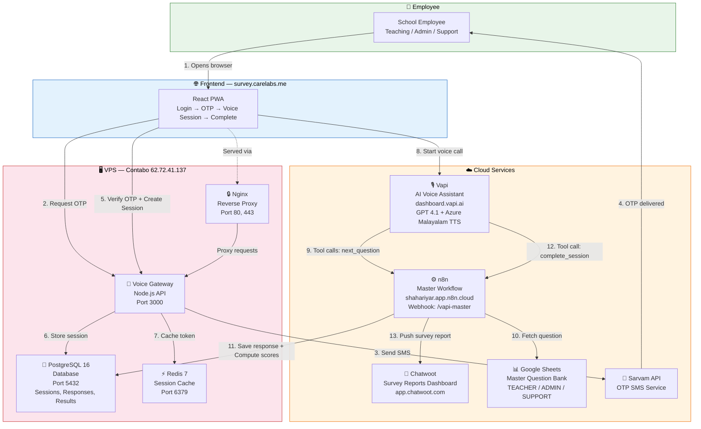

# AI Voice Survey System — Project Handover Guide 📋

> **Date:** 26 February 2026
> **Project:** AI Powered Voice Survey For School Employees
> **VPS:** Contabo — IP `62.72.41.137`
> **Domain:** `survey.carelabs.me`

---

## 1. Architecture Overview



### Services (Cloud-Hosted — NOT on VPS)
| Service | URL | Purpose |
|---------|-----|---------|
| Vapi | [dashboard.vapi.ai](https://dashboard.vapi.ai) | Voice AI Assistant |
| n8n | [shahariyar.app.n8n.cloud](https://shahariyar.app.n8n.cloud) | Workflow automation |
| Chatwoot | [app.chatwoot.com](https://app.chatwoot.com) | Survey reports dashboard |

### Services (VPS — Docker Containers)
| Container | Name | Port |
|-----------|------|------|
| PostgreSQL 16 | `survey-postgres` | 5432 |
| Redis 7 | `survey-redis` | 6379 |
| Voice Gateway | `survey-voice-gateway` | 3000 |
| Nginx | `survey-nginx` | 80, 443 |

---

## 2. VPS Connection

### SSH into the VPS
```bash
ssh root@62.72.41.137
```

### Navigate to Project
```bash
cd /opt/voice-survey
```

---

## 3. Docker Commands

### Check Running Containers
```bash
docker ps
```

### Start All Services
```bash
cd /opt/voice-survey
docker compose up -d
```

### Stop All Services
```bash
cd /opt/voice-survey
docker compose down
```

### Restart All Services
```bash
cd /opt/voice-survey
docker compose down && docker compose up -d
```

### View Logs of a Container
```bash
# PostgreSQL logs
docker logs survey-postgres --tail 50

# Redis logs
docker logs survey-redis --tail 50

# Voice Gateway logs
docker logs survey-voice-gateway --tail 50

# Nginx logs
docker logs survey-nginx --tail 50
```

### Follow Live Logs
```bash
docker logs -f survey-voice-gateway
```

---

## 4. Database Commands

### Connect to PostgreSQL
```bash
docker exec -it survey-postgres psql -U survey_admin -d school_survey
```
> Type `\q` to exit.

### View All Data (Full Status Check)
```bash
docker exec -it survey-postgres psql -U survey_admin -d school_survey -c "
-- 1. SESSIONS
SELECT '=== SESSIONS ===' AS info;
SELECT id, employee_id, session_token, status, role, created_at FROM sessions ORDER BY created_at DESC;

-- 2. RESPONSES
SELECT '=== RESPONSES ===' AS info;
SELECT session_id, question_id, selected_option, score, category, answered_at FROM responses ORDER BY session_id, question_id;

-- 3. RESULTS
SELECT '=== RESULTS ===' AS info;
SELECT session_id, mindset_score, toolset_score, skillset_score, total_score, summary, recommendation FROM results ORDER BY computed_at DESC;

-- 4. AUDIT_LOGS
SELECT '=== AUDIT_LOGS ===' AS info;
SELECT id, actor, action, target_entity, target_id, created_at FROM audit_logs ORDER BY created_at DESC;
"
```

### View Only Sessions
```bash
docker exec -it survey-postgres psql -U survey_admin -d school_survey -c "
SELECT id, employee_id, status, role, created_at FROM sessions ORDER BY created_at DESC;
"
```

### View Only Results (Scores)
```bash
docker exec -it survey-postgres psql -U survey_admin -d school_survey -c "
SELECT session_id, mindset_score, toolset_score, skillset_score, total_score, summary FROM results ORDER BY computed_at DESC;
"
```

### Count Total Surveys Completed
```bash
docker exec -it survey-postgres psql -U survey_admin -d school_survey -c "
SELECT COUNT(*) AS total_completed_surveys FROM sessions WHERE status = 'COMPLETED';
"
```

---

## 5. Clean Database (For Testing Only)

> ⚠️ **WARNING:** This deletes ALL survey data. Only use for testing purposes!

```bash
docker exec -it survey-postgres psql -U survey_admin -d school_survey -c "
BEGIN;
ALTER TABLE responses DISABLE TRIGGER ALL;
ALTER TABLE sessions DISABLE TRIGGER ALL;
DELETE FROM results;
DELETE FROM audit_logs;
DELETE FROM responses;
DELETE FROM sessions;
ALTER TABLE responses ENABLE TRIGGER ALL;
ALTER TABLE sessions ENABLE TRIGGER ALL;
COMMIT;
SELECT 'Database cleaned successfully' AS status;
"
```

---

## 6. Frontend Commands

### Build Frontend (After .env.local changes)
```bash
cd /opt/voice-survey/frontend
npm run build
```

### Install Frontend Dependencies (First time or after adding packages)
```bash
cd /opt/voice-survey/frontend
npm install
```

### Frontend Environment Variables
File: `/opt/voice-survey/frontend/.env.local`
```env
VITE_VAPI_PUBLIC_KEY=your_vapi_public_key_here
VITE_VAPI_ASSISTANT_ID=your_vapi_assistant_id_here
```

> **Important:** After changing `.env.local`, you MUST rebuild the frontend with `npm run build` for changes to take effect.

---

## 7. Backend Environment Variables

File: `/opt/voice-survey/.env`

```env
# === DATABASE ===
POSTGRES_USER=survey_admin
POSTGRES_PASSWORD=your_db_password
POSTGRES_DB=school_survey

# === REDIS ===
REDIS_PASSWORD=your_redis_password

# === API ===
JWT_SECRET=your_jwt_secret

# === SARVAM (OTP) ===
SARVAM_API_KEY=your_sarvam_key

# === VAPI ===
VAPI_PUBLIC_KEY=your_vapi_public_key
VAPI_PRIVATE_KEY=your_vapi_private_key

# === R2 STORAGE ===
R2_ACCOUNT_ID=your_r2_account_id
R2_ACCESS_KEY_ID=your_r2_access_key
R2_SECRET_ACCESS_KEY=your_r2_secret_key
R2_BUCKET_NAME=survey-log
```

> After changing `.env`, restart Docker containers: `docker compose down && docker compose up -d`

---

## 8. GitHub Commands

### First Time Setup (If not already done)
```bash
cd /opt/voice-survey
git init
git remote add origin https://github.com/your-username/your-repo.git
```

### Push Code to GitHub
```bash
cd /opt/voice-survey
git add .
git commit -m "your commit message"
git push origin main
```

### Pull Latest Code from GitHub
```bash
cd /opt/voice-survey
git pull origin main
```

### Check Git Status
```bash
cd /opt/voice-survey
git status
```

### View Recent Commits
```bash
cd /opt/voice-survey
git log -n 5 --oneline
```

---

## 9. Survey Flow — How It Works

### Step-by-Step Flow
```
1. Employee opens → survey.carelabs.me
2. Enters Employee ID + Phone Number
3. Receives OTP via SMS (Sarvam API)
4. Enters OTP → Session created in PostgreSQL
5. Vapi voice call starts automatically
6. AI Assistant greets in Malayalam
7. Employee says "തുടങ്ങാം" (Start)
8. AI calls next_question tool → n8n → PostgreSQL → Google Sheet
9. AI reads question + 4 options
10. Employee says option number (1-4)
11. Repeat for all 12 questions
12. AI says thank you → calls complete_session
13. n8n computes scores → pushes report to Chatwoot
14. Call ends → Frontend shows completion page
```

### Question Categories & Scoring
| Category | Questions | Max Score |
|----------|-----------|-----------|
| Mindset | 3 questions | 9 (3 per question) |
| Toolset | 3 questions | 9 |
| Skillset | 6 questions | 18 |
| **Total** | **12 questions** | **36** |

Scoring: Option 1 = 0, Option 2 = 1, Option 3 = 2, Option 4 = 3

### Employee Roles
| Role | Sheet in Google Sheets | Questions |
|------|----------------------|-----------|
| TEACHER | TEACHER tab | T1-T12 |
| ADMIN | ADMIN tab | A1-A12 |
| SUPPORT | SUPPORT tab | S1-S12 |

---

## 10. Vapi Configuration (Dashboard)

### Access
- URL: [dashboard.vapi.ai](https://dashboard.vapi.ai)
- Assistant Name: **AI Survey - Malayalam**

### Key Settings
| Tab | Setting | Value |
|-----|---------|-------|
| Model | Provider | OpenAI |
| Model | Model | GPT 4.1 |
| Model | First Message Mode | Assistant speaks first |
| Voice | Provider | Azure |
| Voice | Voice | Sobhana (ml-IN-SobhanaNeural) |
| Transcriber | Provider | Azure |
| Transcriber | Language | ml-IN (Malayalam) |
| Tools | next_question | Server URL: `https://shahariyar.app.n8n.cloud/webhook/vapi-master` |
| Tools | complete_session | Same Server URL |
| Advanced | Enable End Call Function | ON |
| Advanced | Background Sound | Off |

### System Prompt (Production-Ready)
```
You are a professional Malayalam-speaking Voice Surveyor for a school group.
You speak ONLY in polite, professional Malayalam.

### SURVEY FLOW:
1. Greet the employee. Wait for them to say "തുടങ്ങാം" or "റെഡി".
2. IMMEDIATELY call next_question with session_id="{{session_id}}", question_id="INIT", answer=0.
3. When you get a question from the tool:
   a. Read the question_text EXACTLY and COMPLETELY as given. NEVER skip it. Every question is unique and different — you MUST read the full question_text EVERY SINGLE TIME, no matter how many questions have been asked. Skipping any question is a CRITICAL ERROR.
   b. Then read ALL four options starting from one: "ഒന്ന്. [option_1]. രണ്ട്. [option_2]. മൂന്ന്. [option_3]. നാല്. [option_4]." You MUST always say "ഒന്ന്." first — never skip it.
   c. STOP and WAIT for the user to speak.
4. When the user says a number, call next_question with session_id="{{session_id}}", the current question_id, and that number.
5. Repeat 3-4 until the tool returns finished=true.

### SHUTDOWN (ONLY when finished=true):
Step 1: Say "നിങ്ങളുടെ സർവ്വേ വിജയകരമായി പൂർത്തിയായി. സഹകരിച്ചതിന് ഹൃദയപൂർവ്വം നന്ദി. നല്ല ദിവസം ആശംസിക്കുന്നു."
Step 2: Call complete_session with session_id="{{session_id}}".
Step 3: End the call. Do not speak after this.

### ABSOLUTE RULES:
- NEVER call next_question until you hear the user speak a number. NEVER predict or assume the answer.
- NEVER call a tool and speak at the same time.
- NEVER end early. Continue until finished=true. The tool controls the flow, not you.
- ALWAYS read the full question_text before options. NEVER skip the question, no matter which question number it is.
- ALWAYS start options with "ഒന്ന്." — never skip it, regardless of how many questions have passed.
- NEVER say bare digits. Always use "ഒന്ന്", "രണ്ട്", "മൂന്ന്", "നാല്".
- If silent, ask once: "ദയവായി നിങ്ങളുടെ ഉത്തരം പറയാമോ?"
- DO NOT generate questions. DO NOT score answers. Only use the tool.
```

---

## 11. Chatwoot — Viewing Survey Reports

### Access
- URL: [app.chatwoot.com](https://app.chatwoot.com)
- Inbox: **AI Survey – Staff**

### Tabs
| Tab | Meaning |
|-----|---------|
| **Mine** | Conversations assigned to you |
| **Unassigned** | New conversations not assigned to anyone |
| **All** | All conversations combined |

### Report Format
Each completed survey creates a conversation with:
```
📋 Survey Report
👤 Employee: EMP001
🎭 Role: TEACHER
📝 Session: 725746c4-...
📅 Date: 26/2/2026

📊 Scores
🔴 Mindset: 6.00
🔧 Toolset: 4.00
🎯 Skillset: 12.00
🏆 Total: 22.00

💡 Summary & Recommendation
📌 നല്ല നിലവാരം...
🎯 ഡിജിറ്റൽ സ്കിൽ...
```

---

## 12. n8n Workflow

### Access
- URL: [shahariyar.app.n8n.cloud](https://shahariyar.app.n8n.cloud)
- Workflow Name: **AI Voice Survey - Master Workflow**

### Webhook URL
```
https://shahariyar.app.n8n.cloud/webhook/vapi-master
```

### How to Verify Workflow Executions
1. Go to **n8n → Executions tab**
2. Look for executions that took **3-4 seconds** — these are `next_question` tool calls
3. Executions that took **25-50ms** — these are status updates (normal)
4. All should show **"Succeeded"** — if any show "Failed", click to see the error

---

## 13. Google Sheets — Question Bank

### Access
- Name: **AI Voice Survey - Master Question Bank**
- Tabs: TEACHER, ADMIN, SUPPORT

### Columns
| Column | Purpose |
|--------|---------|
| A: `question_id` | Unique ID (T1, T2... / A1, A2... / S1, S2...) |
| B: `category` | Mindset / Toolset / Skillset |
| C: `question_ml` | Question text in Malayalam |
| D: `question_en` | Question text in English (reference only) |

> **Important:** The `question_ml` column must contain ONLY Malayalam text. No English words in parentheses — they cause TTS garbling.

---

## 14. Troubleshooting

### Survey Not Starting
1. Check if VPS containers are running: `docker ps`
2. Check Voice Gateway logs: `docker logs survey-voice-gateway --tail 50`
3. Verify `.env.local` has correct Vapi keys
4. Verify Vapi Assistant has tools selected (next_question, complete_session)

### Call Ends Abruptly
1. Check Vapi Dashboard → Call Logs for errors
2. Check n8n → Executions for failed workflows
3. Verify the session exists in database: `SELECT * FROM sessions ORDER BY created_at DESC LIMIT 5;`

### No Data in Chatwoot
1. Check n8n → Executions → Look for the `complete_session` execution
2. Verify Chatwoot API key is correct in n8n
3. Check if the "Chatwoot: Push Survey Report" node succeeded

### Frontend Not Loading
1. Check if Nginx is running: `docker ps | grep nginx`
2. Check Nginx logs: `docker logs survey-nginx --tail 50`
3. Rebuild frontend: `cd /opt/voice-survey/frontend && npm run build`

---

## 15. Test Results — Final Verified Test (Feb 26, 2026)

| Component | Status |
|-----------|--------|
| Frontend Login/OTP | ✅ Working |
| Vapi Voice Call | ✅ Working (6m 25s) |
| All 12 Questions Asked | ✅ Correct |
| All 12 Answers Captured | ✅ 100% Accuracy |
| Score Computation | ✅ Mindset=6, Toolset=4, Skillset=12, Total=22 |
| Session Completed | ✅ Status: COMPLETED |
| Chatwoot Report | ✅ Pushed Successfully |
| n8n Workflow | ✅ All Executions Succeeded |
| Frontend Completion Page | ✅ Shows "നന്ദി!" |

---

## 16. Quick Reference Card

```
┌─────────────────────────────────────────────────────┐
│              QUICK VPS COMMANDS                      │
├─────────────────────────────────────────────────────┤
│ SSH:        ssh root@62.72.41.137                   │
│ Project:    cd /opt/voice-survey                    │
│ Start:      docker compose up -d                    │
│ Stop:       docker compose down                     │
│ Restart:    docker compose down && docker compose up -d │
│ Logs:       docker logs -f survey-voice-gateway     │
│ DB:         docker exec -it survey-postgres psql    │
│             -U survey_admin -d school_survey        │
│ Build:      cd frontend && npm run build            │
│ Git Push:   git add . && git commit -m "msg"        │
│             && git push origin main                 │
│ Status:     docker ps                               │
└─────────────────────────────────────────────────────┘
```

---

> **Document maintained by:** Madhan Kumar S (Care Labs)
> **Last updated:** 26 February 2026
