# Deep Root Cause Analysis: UUID "INIT" Error 🔍

## The Error

```
invalid input syntax for type uuid: "INIT"
```

At node: `Postgres: Fetch Session`, executing: `WHERE id = $1` with `$1 = "INIT"`

---

## The Complete Data Flow (Traced from JSON)

```mermaid
flowchart TD
    A["1. You click 'Talk to Assistant'"] --> B["2. AI speaks Malayalam greeting"]
    B --> C["3. You say 'തുടങ്ങാം'"]
    C --> D["4. AI calls next_question tool"]
    D --> E["5. Vapi POSTs to /webhook/vapi-master"]
    E --> F["6. Switch: Event Type → 'tool-calls'"]
    F --> G["7. Switch: Tool Call Name → 'next_question'"]
    G --> H["8. Postgres: Fetch Session ❌ CRASH HERE"]
    
    style H fill:#ff4444,color:white
```



**What the AI sent to the tool:**

| Parameter | What AI Sent | What Was Expected |
| :--- | :--- | :--- |
| `session_id` | `"INIT"` ❌ | A real UUID like `a1b2c3d4-...` |
| `question_id` | `"INIT"` ✅ | `"INIT"` (correct for first call) |
| `answer` | `0` ✅ | `0` (correct for first call) |

---

## Root Cause: The AI Has No Session ID

### Why?

In the **production flow** (Phases 3 → 4 → 8 → 6 → 5):

```
Employee opens PWA (Phase 8)
  → Enters Employee ID
  → Receives OTP (Phase 3)  
  → Verifies OTP → Gets JWT with session_id (UUID)
  → PWA starts Vapi call with assistantOverrides containing session_id
  → AI receives session_id automatically
  → AI passes it to next_question tool
  → n8n validates it ✅
```

In the **dashboard test** (what you did):

```
You click "Talk to Assistant" in Vapi Dashboard
  → No PWA, no OTP, no JWT, no session
  → AI has NO session_id
  → AI uses "INIT" because it doesn't know any UUID
  → Postgres rejects "INIT" as invalid UUID ❌
```

> [!IMPORTANT]
> **This is NOT a bug in your n8n workflow.** Your workflow is correctly requiring a valid session. The issue is that dashboard testing skips the authentication flow (Phases 3/4/8), so there's no session_id available.

---

## Is Phase 5 Complete? — Line-by-Line Audit

| Checklist Line | Requirement | Workflow Node | Status |
| :--- | :--- | :--- | :--- |
| **L75** | Create master webhook `/webhook/vapi-master` | `Webhook: Vapi Master` (path: `vapi-master`) | ✅ |
| **L77** | Validate session state | `Postgres: Fetch Session` + `If: Valid Session?` | ✅ |
| **L79** | Fixed question bank per role | `Switch: User Role Router` + `Get row(s) in sheet` | ✅ |
| **L81** | Deterministic rubric scoring | `Postgres: Save Response` (score = answer - 1) | ✅ |
| **L83** | Store response per question | `Postgres: Save Response` (INSERT per question) | ✅ |
| **L84** | Compute final scores | `Postgres: Compute Final Scores` | ✅ |
| **L86** | Push to Chatwoot | `HTTP Request (Chatwoot Push)` — disabled | ⏸️ Deferred |
| **L88** | Burn session token | `Postgres: Burn Session Token` | ✅ |

**Phase 5 verdict: ✅ COMPLETE** (L86 intentionally deferred to Phase 8).

---

## Secondary Issue Found in Workflow JSON

The `Postgres: Fetch Session` node correctly handles both string and object arguments:

```javascript
// ✅ Handles both formats
typeof arguments === 'string' ? JSON.parse(arguments).session_id : arguments.session_id
```

But **3 other nodes** do NOT handle the string case:

| Node | Expression | Handles String Args? |
| :--- | :--- | :--- |
| `Postgres: Count Responses` | `.arguments.session_id` | ❌ |
| `Code: Pick Next Question` | `.arguments.session_id` | ❌ |
| `Postgres: Save Response` | `.arguments.question_id`, `.arguments.answer` | ❌ |

> [!NOTE]
> This is not the cause of the current crash (the crash happens earlier), but it may cause errors later when Vapi sends arguments as a JSON string. We should fix these for safety.

---

## The Fix: What To Do (Without Breaking Any Requirements)

### Step 1: Create a Test Session on Your VPS

SSH into your VPS and run:

```sql
docker exec -it survey-postgres psql -U survey_admin -d school_survey -c "
INSERT INTO sessions (employee_id, session_token, status, role, expires_at)
VALUES ('TEST_EMP_001', 'test-token-vapi', 'VERIFIED', 'TEACHER', NOW() + INTERVAL '72 hours')
RETURNING id;
"
```

This will return a UUID. Copy it.

### Step 2: Update the Vapi System Prompt

In the **Model** tab, update line 2 of the SURVEY FLOW section:

```diff
### SURVEY FLOW:
1. After greeting the employee, wait for them to respond.
-2. When the employee confirms they are ready, call the next_question tool with answer=0 and question_id="INIT" to get the first question.
+2. When the employee confirms they are ready, call the next_question tool with session_id="<PASTE UUID HERE>", question_id="INIT", and answer=0 to get the first question.
+3. For ALL subsequent calls, use the SAME session_id.
-3. When you receive a question from the tool, speak it EXACTLY as provided.
+4. When you receive a question from the tool, speak it EXACTLY as provided.
```

### Step 3: Test Again

Click "Talk to Assistant" → Say "തുടങ്ങാം" → AI sends the real UUID → n8n accepts it ✅

---

## Does This Break Any Requirements?

**No.** Here's why:

| Concern | Answer |
| :--- | :--- |
| Will the workflow change? | **No.** Zero changes to n8n. |
| Will the database change? | **No.** We only INSERT a test row. |
| Is hardcoding a UUID permanent? | **No.** In production, the PWA (Phase 8) will pass the UUID automatically via `assistantOverrides`. |
| Does this skip security? | **No.** The session still has `status = 'VERIFIED'`, maintaining the security requirement. |

> [!TIP]
> **In production**, the system prompt will NOT have a hardcoded UUID. The PWA will inject it dynamically. This hardcoded UUID is **only for dashboard testing** during Phase 6/L103.
